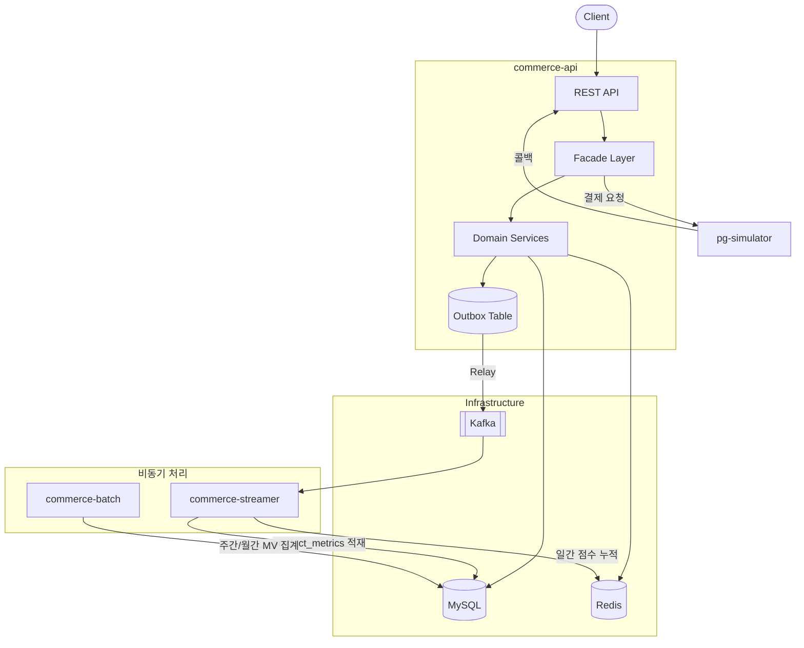

# Commerce Backend

커머스 도메인의 주문/결제, 상품/랭킹, 이벤트 파이프라인을 구현한 Spring Boot 멀티모듈 백엔드입니다.

동기 API와 비동기 이벤트 처리를 조합하여, 주문 생성부터 결제 확인, 재고 차감, 랭킹 집계까지의 전체 흐름을 다룹니다.

---

## 시스템 아키텍처

### 핵심 흐름

| 흐름 | 설명 |
|------|------|
| 주문 → 결제 | 주문 `PENDING` 저장 → PG 결제 요청 → 콜백/복구로 상태 확정 |
| 이벤트 파이프라인 | 조회/좋아요/판매 이벤트 → Outbox → Kafka → Streamer가 metrics 적재 |
| 랭킹 집계 | 일간: Redis Sorted Set / 주간·월간: Batch가 MySQL MV 테이블로 집계 |

---

## 기술적 챌린지

### 1. 재고 정합성 — 비관적 락

동시 주문 시 재고가 음수가 되는 것을 방지하기 위해 `SELECT FOR UPDATE` 비관적 락을 사용합니다. 낙관적 락 대비 재시도 로직이 불필요하고, 선착순 정확성을 보장합니다.

> [ADR-003: 주문 재고 차감은 비관적 락 사용](docs/adr/ADR-003-order-pessimistic-lock-strategy.md)

### 2. 이벤트 전달 신뢰성 — Transactional Outbox

도메인 트랜잭션 커밋과 Kafka 메시지 발행의 원자성을 보장하기 위해 Outbox 패턴을 사용합니다. `BEFORE_COMMIT`에서 Outbox에 기록하고, Relay가 Kafka로 전송합니다. 즉시 발행(AFTER_COMMIT) + 주기적 Relay 이중 전략으로 지연과 신뢰성을 모두 확보합니다.

### 3. 주문-결제 상태 관리 — 이벤트 기반 비동기 처리

주문 생성은 동기로 `PENDING` 저장 후 즉시 응답하고, 포인트 차감/쿠폰 사용/재고 확인은 `@TransactionalEventListener(AFTER_COMMIT)` + `@Async`로 후속 처리합니다. PG 결제는 콜백과 복구 스케줄러로 최종 상태를 확정합니다.

### 4. 랭킹 저장소 분리 — Redis + MySQL MV

일간 랭킹은 실시간성이 필요하므로 Redis Sorted Set, 주간/월간 랭킹은 정확한 집계가 필요하므로 Spring Batch로 MySQL Materialized View 테이블에 저장합니다. 조회 특성에 맞게 저장소를 분리하여 각각의 요구사항을 최적화합니다.

---

## 기술 스택

| 카테고리 | 기술 |
|----------|------|
| Language / Framework | Java 21, Spring Boot 3.4, Spring Batch |
| Data | MySQL 8.0, Spring Data JPA, QueryDSL |
| Cache | Redis 7 |
| Messaging | Apache Kafka 3.5, Spring Kafka |
| Resilience | OpenFeign, Resilience4j |
| Observability | Micrometer, Prometheus, Grafana |
| API Docs | SpringDoc OpenAPI |
| Test | JUnit 5, Testcontainers, Mockito, Instancio |

---

## 설계 문서

| 문서 | 내용 |
|------|------|
| [01. 요구사항 명세](docs/design/01-requirements.md) | API별 기능 요구사항, 상태 전이, 비기능 요구사항 |
| [02. 시퀀스 다이어그램](docs/design/02-sequence-diagrams.md) | 주문/결제/좋아요/랭킹 등 핵심 흐름의 시퀀스 |
| [03. 클래스 다이어그램](docs/design/03-class-diagram.md) | 도메인 모델, 레이어 구조, 상태 다이어그램 |
| [04. ERD](docs/design/04-erd.md) | 테이블 구조, 제약조건, 인덱스 설계 |

### Architecture Decision Records

| ADR | 결정 |
|-----|------|
| [ADR-001](docs/adr/ADR-001-order-orderitem-bidirectional-relationship.md) | Order-OrderItem 양방향 관계 (Aggregate Root) |
| [ADR-002](docs/adr/ADR-002-productlike-hard-delete-strategy.md) | ProductLike Hard Delete 전략 |
| [ADR-003](docs/adr/ADR-003-order-pessimistic-lock-strategy.md) | 주문 재고 차감 비관적 락 |
