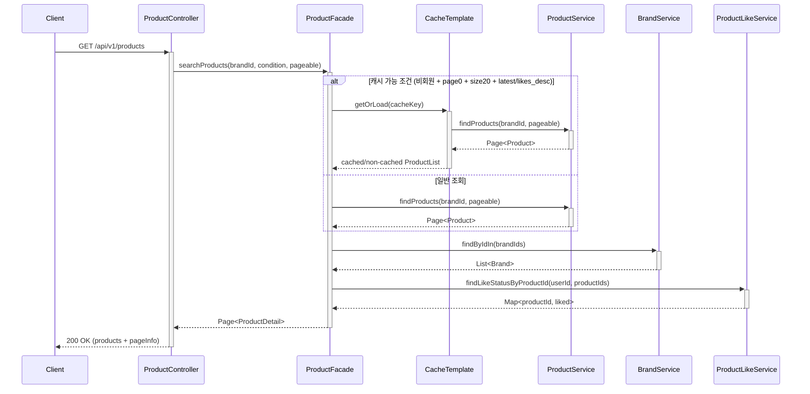
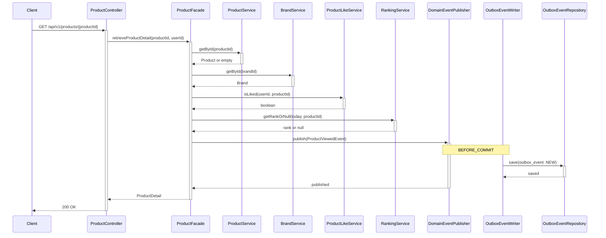
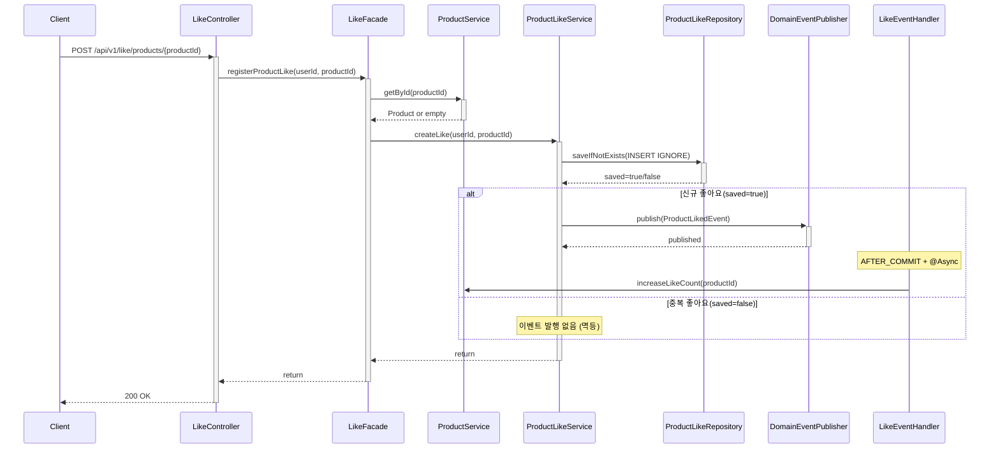
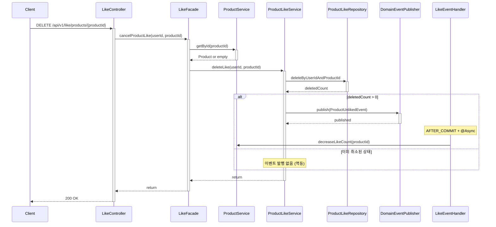
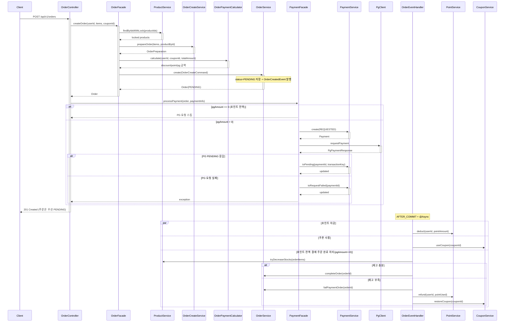
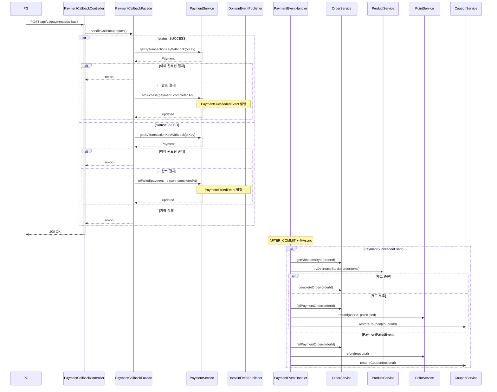
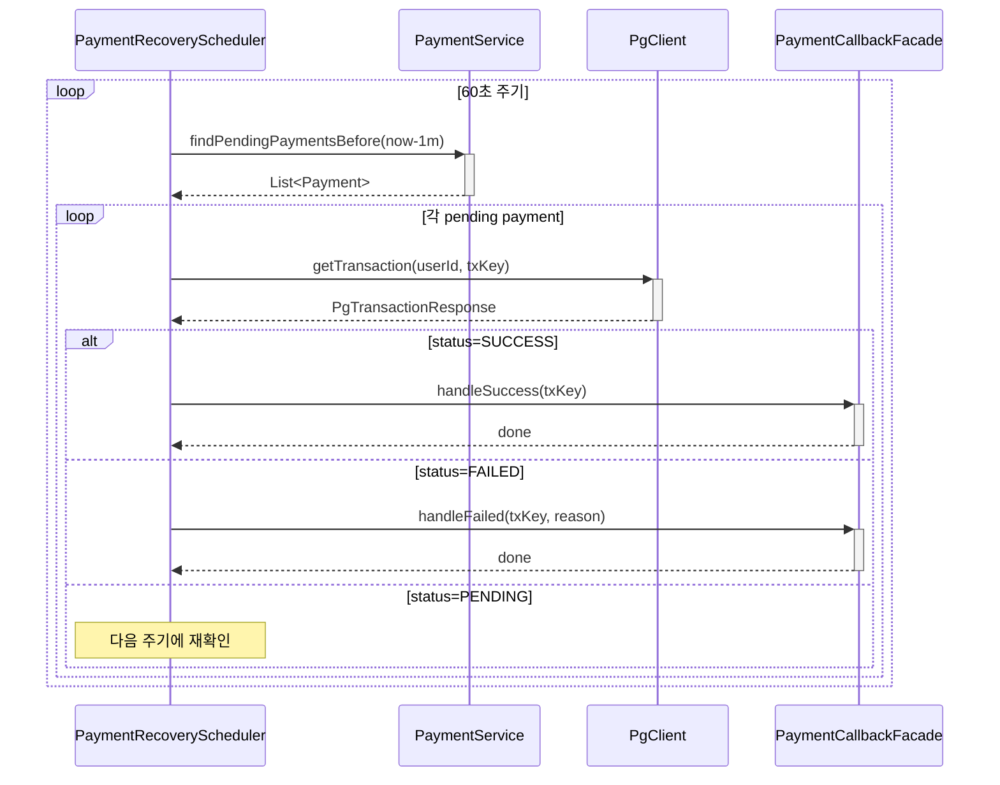
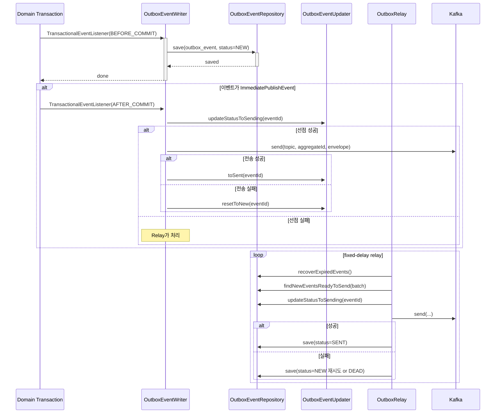
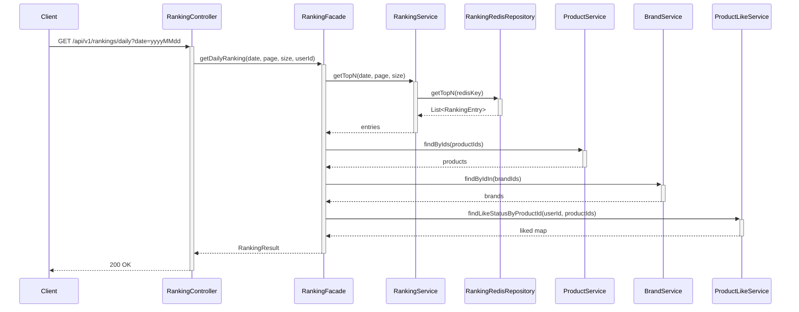
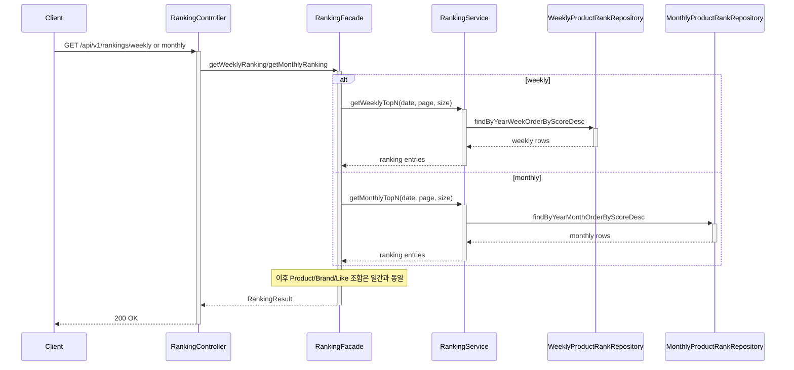

# 02-sequence-diagrams.md - 시퀀스 다이어그램 (현재 코드 기준)

연결 문서:
- 개요: [README.md](../../README.md)
- 요구사항: [01-requirements.md](01-requirements.md)
- 클래스: [03-class-diagram.md](03-class-diagram.md)
- ERD: [04-erd.md](04-erd.md)

## 목차
- [1. 상품 목록 조회](#1-상품-목록-조회)
- [2. 상품 상세 조회 + 조회 이벤트 기록](#2-상품-상세-조회--조회-이벤트-기록)
- [3. 좋아요 등록 (멱등)](#3-좋아요-등록-멱등)
- [4. 좋아요 취소 (멱등)](#4-좋아요-취소-멱등)
- [5. 주문 생성](#5-주문-생성)
- [6. 결제 콜백 처리](#6-결제-콜백-처리)
- [7. 결제 복구 스케줄러](#7-결제-복구-스케줄러)
- [8. Outbox 발행/Relay](#8-outbox-발행relay)
- [9. 일간 랭킹 조회](#9-일간-랭킹-조회)
- [10. 주간/월간 랭킹 조회](#10-주간월간-랭킹-조회)

## 1. 상품 목록 조회

## 2. 상품 상세 조회 + 조회 이벤트 기록

## 3. 좋아요 등록 (멱등)

## 4. 좋아요 취소 (멱등)

## 5. 주문 생성

## 6. 결제 콜백 처리

## 7. 결제 복구 스케줄러

## 8. Outbox 발행/Relay

## 9. 일간 랭킹 조회

## 10. 주간/월간 랭킹 조회

