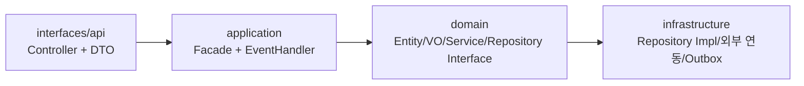
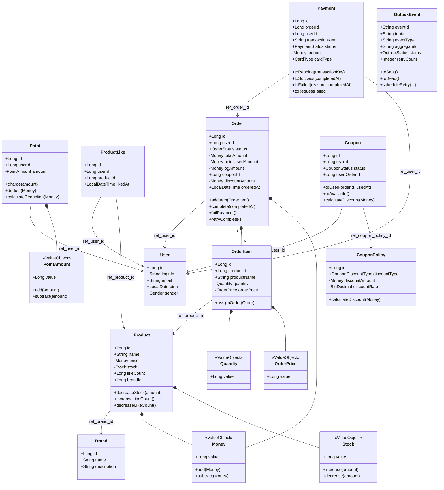
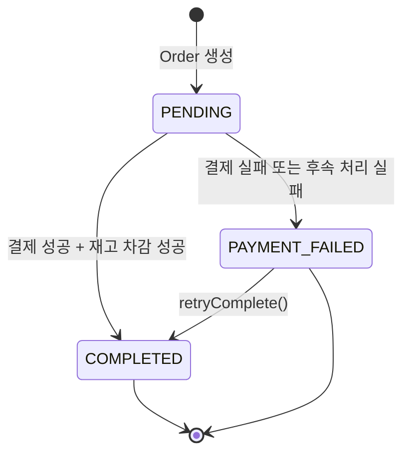
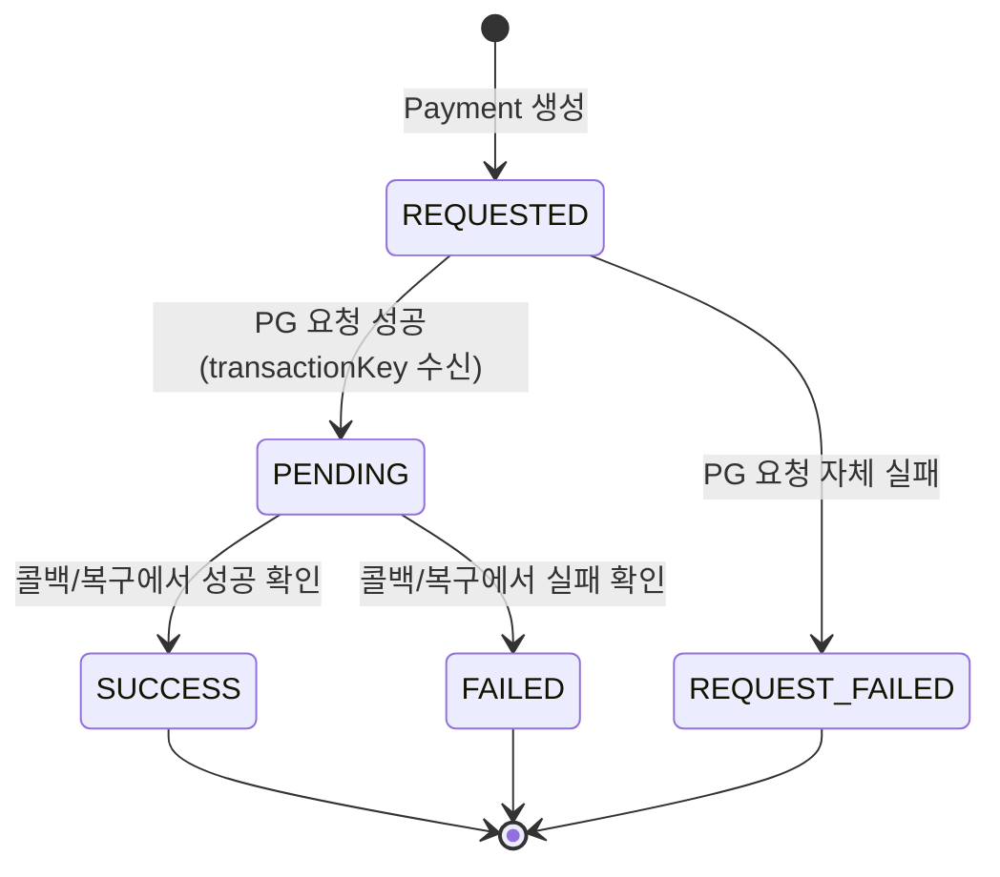

# 03-class-diagram.md - 클래스 다이어그램 (현재 코드 기준)

연결 문서:
- 개요: [README.md](../../README.md)
- 요구사항: [01-requirements.md](01-requirements.md)
- 시퀀스: [02-sequence-diagrams.md](02-sequence-diagrams.md)
- ERD: [04-erd.md](04-erd.md)

## 1. 레이어 구조

## 2. 핵심 도메인 모델

## 3. 애플리케이션 오케스트레이션

```mermaid
classDiagram
    class ProductFacade
    class LikeFacade
    class OrderFacade
    class PaymentFacade
    class PaymentCallbackFacade
    class RankingFacade

    class ProductService
    class ProductLikeService
    class OrderService
    class OrderCreateService
    class OrderPaymentCalculator
    class PaymentService
    class PointService
    class CouponService
    class RankingService

    class LikeEventHandler
    class OrderEventHandler
    class PaymentEventHandler

    class OutboxEventWriter
    class OutboxRelay
    class OutboxEventUpdater

    ProductFacade --> ProductService
    ProductFacade --> ProductLikeService
    ProductFacade --> RankingService

    LikeFacade --> ProductService
    LikeFacade --> ProductLikeService
    LikeEventHandler --> ProductService

    OrderFacade --> ProductService
    OrderFacade --> OrderCreateService
    OrderFacade --> OrderPaymentCalculator
    OrderFacade --> OrderService

    PaymentFacade --> PaymentService
    PaymentCallbackFacade --> PaymentService
    PaymentCallbackFacade --> OrderService

    OrderEventHandler --> PointService
    OrderEventHandler --> CouponService
    OrderEventHandler --> ProductService
    OrderEventHandler --> OrderService

    PaymentEventHandler --> OrderService
    PaymentEventHandler --> ProductService
    PaymentEventHandler --> PointService
    PaymentEventHandler --> CouponService

    RankingFacade --> RankingService
    RankingFacade --> ProductService
    RankingFacade --> ProductLikeService

    OutboxEventWriter --> OutboxEventUpdater
    OutboxRelay --> OutboxEventUpdater
```

## 4. 상태 다이어그램

### 4.1 주문 상태 (`OrderStatus`)

### 4.2 결제 상태 (`PaymentStatus`)

## 5. 설계 포인트
- 주문은 생성 시 항상 `PENDING`으로 저장되고, 완료/실패는 이벤트 핸들러가 후속 반영한다.
- 좋아요 수(`product.like_count`)는 이벤트 기반 비동기 반영이므로 짧은 지연이 발생할 수 있다.
- `OrderItem`은 `Order`와 양방향 객체 참조(`@OneToMany`/`@ManyToOne`)로 Aggregate 일관성을 유지한다.
- 외부 전송은 Outbox 패턴으로 분리되어 트랜잭션 커밋과 메시지 발행 신뢰성을 동시에 확보한다.
