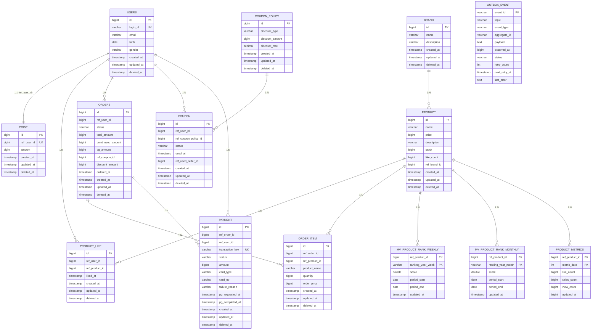

# 04-erd.md - ERD (현재 엔티티 기준)

연결 문서:
- 개요: [README.md](../../README.md)
- 요구사항: [01-requirements.md](01-requirements.md)
- 시퀀스: [02-sequence-diagrams.md](02-sequence-diagrams.md)
- 클래스: [03-class-diagram.md](03-class-diagram.md)

## 1. 핵심 테이블 구조

## 2. 제약조건 요약
- `product_like`: `UNIQUE(ref_user_id, ref_product_id)`
- `point`: `UNIQUE(ref_user_id)`
- `payment`: `UNIQUE(transaction_key)`
- `mv_product_rank_weekly`: 복합 PK `(ref_product_id, ranking_year_week)`
- `mv_product_rank_monthly`: 복합 PK `(ref_product_id, ranking_year_month)`
- `product_metrics`: 복합 PK `(ref_product_id, metric_date)`

## 3. 인덱스 요약 (주요)
- `product`
  - `idx_product_like_count (like_count DESC)`
  - `idx_product_price (price)`
  - `idx_product_brand_like (ref_brand_id, like_count DESC)`
  - `idx_product_brand_id (ref_brand_id, id DESC)`
  - `idx_product_brand_price (ref_brand_id, price)`
- `product_like`
  - `idx_product_like_user_liked (ref_user_id, liked_at DESC)`
- `orders`
  - `idx_order_user_id (ref_user_id)`
  - `idx_order_user_ordered_at (ref_user_id, ordered_at DESC)`
- `payment`
  - `idx_payment_order_id (ref_order_id)`
  - `idx_payment_user_id (ref_user_id)`
  - `idx_payment_status_requested_at (status, pg_requested_at)`
  - `idx_payment_transaction_key (transaction_key)`
- `outbox_event`
  - `idx_outbox_status_retry (status, next_retry_at)`
  - `idx_outbox_aggregate (event_type, aggregate_id, occurred_at)`

## 4. 설계 메모
- 외래키 컬럼명은 `ref_` 접두사를 사용한다.
- `OrderItem`만 `Order`와 객체 참조 관계를 가지며, 나머지는 ID 참조 중심으로 설계한다.
- `orders`는 금액을 `total_amount`, `discount_amount`, `point_used_amount`, `pg_amount`로 분해 저장한다.
- 랭킹은 저장소를 분리한다.
  - 일간: Redis Sorted Set (`ranking:all:yyyyMMdd`)
  - 주/월간: MySQL MV 테이블 (`mv_product_rank_weekly`, `mv_product_rank_monthly`)
- 이벤트 전달은 `outbox_event` 기반으로 보장한다.
